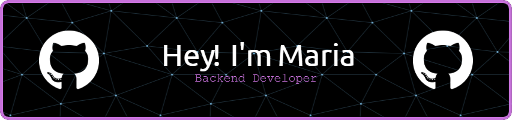

    
      
    
    
    
    

## About Me

I am **Maria Papadopoulou**, a **Senior Backend Engineer** with expertise in **PHP** and growing experience in **Python**, focused on building **scalable, data-intensive systems**.

Currently at **Schoox**, I work on backend architecture powering **millions of enterprise learners**, emphasizing **performance, reliability, and clean design**. I thrive on challenges close to the **core system**: APIs, databases, search, and complex production problems.

### Focus Areas

- Backend API design and microservices architecture
- Monolith → Microservices migrations
- Search systems (Solr) and data modeling for high performance
- Debugging complex production issues (PHP, MySQL, cloud infrastructure)
- Automation, internal tools, and improving developer workflows
- Clear engineering documentation and system design

## Key Projects

### [CareerPilot](https://github.com/Maria-Papa/CareerPilot) - Personal ATS & Job-Hunting Automation

A local-first project automating my job-search workflow, focused on **backend architecture, automation, and data**.

Features include:

- Job application tracking and interview management
- Automated job listing scraping and monitoring
- CV/cover letter generation and management
- Timeline, salary, and cost-of-living visualizations

**Tech:** Python 3.11, FastAPI, Playwright, SQLite, Next.js, TypeScript, Tailwind, Docker

> Open-sourced progressively, showcasing architecture decisions and backend-focused automation.

## Tech Stack

### Backend Languages

### Backend Frameworks & APIs

### Testing & Coverage

### Databases & Search

### DevOps & Cloud

### Frontend & Supporting

### Developer Tools

## How I Work

- Clean, readable, well-documented code
- Strong separation of concerns & explicit architecture
- Pragmatic decisions over hype
- Collaboration with product, QA, and DevOps
- Systems that are easy to **operate**, not just build

## Holopin

